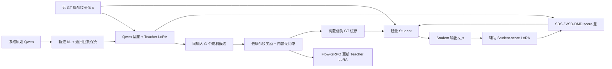

# Qwen-Image-Edit 到轻量去摩尔纹网络的奖励对齐分布蒸馏方案

## 0. 结论先行

这个任务可行，但推荐把它拆成三个相互隔离的闭环，而不是把 GRPO、SDS、DMD 作为三个普通 loss 同时反传：

1. **Teacher 对齐闭环**：冻结 Qwen-Image-Edit 基座，只训练任务 LoRA；用 Flow-GRPO 和无 GT 的复合奖励学习“去摩尔纹且不改内容”。
2. **伪 GT 闭环**：每个输入在线生成一组候选，经过硬约束、奖励排序和置信度过滤后写入带版本的伪 GT 缓存；Student 主要从这个稳定缓存学习确定性映射。
3. **分布蒸馏闭环**：Student 先使用条件 SDS；稳定后增加一个只拟合 Student 输出分布的辅助 score LoRA，把 SDS 升级成 VSD/DMD。Teacher 的梯度永远不从 Student loss 获得。

Teacher 原模型和 `原模型 + 任务 LoRA` 之间不建议在目标数据上直接做 DMD。这个差异的合理角色是**参考策略约束**，应使用 Flow-GRPO 的轨迹 KL；再在 no-edit/通用回放数据上使用 velocity preservation。若把原模型分布作为目标数据上的 DMD “real distribution”，会把刚由奖励学到的去摩尔纹能力拉回原模型。

建议方法名可暂定为 **RA-CDM: Reward-Aligned Conditional Distribution Matching for Demoireing**。

## 1. 对已有笔记的补充与纠正

### 1.1 ProlificDreamer / VSD

`03_ProlificDreamer.md` 的主线正确，但需要补上两点：

- VSD 不只是“生成一个分布”，还引入了一个可训练 score 模型来估计当前生成分布。生成器更新来自“目标 diffusion score”和“当前生成分布 score”的差。
- SDS 可以看作 VSD 的退化形式：用本次前向加进去的噪声代替当前生成分布 score。对确定性图像恢复网络，这往往更容易过平滑或向单一高概率模式偏移。

### 1.2 OSEDiff

`02_OSEDiff.md` 中“VSD 作分布正则”是对的，但 OSEDiff 的公开训练并不是无 GT 训练。它同时使用 paired reconstruction loss 和 VSD。公开代码里有三个关键对象：

- 一步生成器；
- 固定的预训练 diffusion score；
- 一个 LoRA score regularizer，持续在生成器输出上做去噪拟合。

生成器的 VSD 梯度使用两者预测的 `x0` 差，并做样本级归一化。这正是本方案中 `teacher_ema` 与 `student_score` 两个 adapter 的来源。

### 1.3 DMD / DMD2

`04_DMD_OneStep_Diffusion.md` 还缺一个实现关键点：原始 DMD 需要一个 fake score network 来跟踪不断变化的生成分布。DMD2 进一步指出，若 fake score 跟不上 generator，会引起训练不稳定，因此使用 two-time-scale 更新，即 fake score 每次更新得比 generator 更充分。

在本任务中：

- `teacher_ema` 是目标/real score；
- `student_score` LoRA 是 fake score；
- SwinIR 是 generator；
- `student_score` 每次做 3--5 步，再做 1 步 SwinIR，是比“一步各更新一次”更稳的默认值。

## 2. 问题定义

记：

- `x`：真实摩尔纹图像，没有 GT；
- `p`：去摩尔纹编辑 prompt；
- `T0`：冻结的 Qwen-Image-Edit 20B 基座；
- `T_phi = T0 + LoRA_phi`：由 Flow-GRPO 更新的任务 Teacher；
- `T_bar_phi`：Teacher LoRA 的 EMA 快照，只给 Student 提供伪 GT 和 score；
- `F_psi = T0 + LoRA_psi`：拟合当前 Student 输出分布的辅助 fake score；
- `S_theta`：SwinIR/NAFNet/Restormer 等轻量确定性恢复网络；
- `y_s = S_theta(x)`：Student 输出；
- `y_t^k`：Teacher 对同一个 `x` 的第 `k` 个随机 rollout。

最终部署时只保留 `S_theta`，Qwen、奖励模型和两个 LoRA 均不参与推理。

## 3. 总体结构



三个 stop-gradient 边界必须明确：

- GRPO 只更新 `phi`；
- fake-score flow matching 只更新 `psi`，输入 `S_theta(x)` 必须 detach；
- Student loss 只更新 `theta`，Teacher 和 fake score 的输出都必须 detach。

## 4. Teacher：用 Flow-GRPO 学习任务偏好

### 4.1 为什么是 Flow-GRPO，而不是文本模型版 GRPO

Qwen-Image-Edit 是 flow-matching 图像模型。其常规 ODE 采样是确定性的，没有可用于 policy gradient 的随机转移概率。需要采用 Flow-GRPO 的做法，把允许探索的采样区间改成保持边缘分布的 SDE，并记录每个随机去噪转移的 log-probability。确定性 ODE 区间必须在 policy loss 中 mask 掉。

不要对最终图像奖励写 `loss = -reward` 后直接穿过 40 步 sampler；那既不是 GRPO，也会带来极高显存和不稳定的长链梯度。

### 4.2 每个输入的 group rollout

对同一个 `(x,p)` 用 `G=4--8` 个随机种子采样：

```text
y_t^1, ..., y_t^G ~ pi_phi(. | x, p)
```

记录 SDE 窗口内每一步旧策略 log-prob、参考模型 log-prob 和 latent transition。奖励在最终解码图像上计算，然后在同一个输入的 group 内标准化：

```text
A_k = (R_k - mean_group(R)) / (std_group(R) + eps)
```

Teacher objective：

```text
L_teacher = L_GRPO-clip
          + beta_ref * KL_trajectory(pi_phi || pi_0)
          + lambda_keep * L_velocity-preserve
```

其中 `L_velocity-preserve` 只在 no-edit、轻微摩尔纹或通用编辑回放数据上计算：

```text
L_velocity-preserve = E ||v_phi(z_sigma,c) - stopgrad(v_0(z_sigma,c))||^2
```

### 4.3 Teacher 与原模型的 “DMD loss” 应如何处理

原设想中 `T0` 与 `T_phi` 可以在任意 noisy latent 上计算 velocity/score 差，但不能直接据此宣称得到了标准 DMD：

- DMD 中 generator 和 fake-score estimator 是不同角色；
- 这里同一个 LoRA 同时决定 rollout 和 score，如果沿采样路径反传，计算重；若不沿路径反传，梯度又不等于分布 KL；
- 在目标摩尔纹数据上最小化 `KL(p_phi || p_0)` 本质是让 LoRA 回到原模型。

因此推荐：

1. **主约束**：Flow-GRPO 轨迹 reference KL；
2. **保能力约束**：通用/no-edit replay 上的 velocity MSE；
3. **不在目标数据上另加 Teacher-DMD**。

如果实验上仍要验证 Teacher-DMD，只把它作为小权重、off-domain 的消融项，并与 reference KL 二选一，避免重复约束。

## 5. 无 GT 奖励设计

单一频谱奖励一定会被“整张图模糊”利用。推荐先逐项在 group 内标准化，再加权，并把内容一致性设为硬约束：

```text
R = 1.0 * R_demoire
  + 0.4 * R_natural
  + 0.3 * R_detail
  + 0.2 * R_cycle
  + 0.2 * R_preference
  - hard_penalty(content / identity / OCR violation)
```

### 5.1 `R_demoire`

优先级从高到低：

1. 冻结的局部摩尔纹分割/严重度网络，输出 `1 - severity(y)`；
2. 从输入频谱检测异常峰和方向带，只惩罚输出在这些自适应频带的能量；
3. 多尺度色度振荡与周期纹理统计。

摩尔纹 detector 可先用屏幕像素阵列、CFA、透视、缩放、失焦、rolling shutter、噪声和 JPEG 合成 paired 数据训练，再用少量真实图做排序校准。只使用手工 FFT 指标不够稳。

### 5.2 内容硬约束

- 低通后的 `L1/SSIM(y,x)`，保护几何和大结构；
- DINO/自监督特征的 patch cosine；
- 有人脸时加 ArcFace identity；
- 有文字时加 OCR 文本与位置一致性；
- 输入中非摩尔纹区域的边缘/梯度保真。

若任何硬约束低于阈值，候选不能成为伪 GT，并在 GRPO 中受到固定负惩罚。这样比把所有项简单加权更难 reward hacking。

### 5.3 自然度和细节

- DeQA/MUSIQ 等自然图像质量分数只作为弱奖励；
- 用非摩尔纹区域的梯度能量、Laplacian 或 DINO patch detail 防止过平滑；
- 可加入一个 clean-vs-restored preference reward，但必须与内容硬约束一起用。

### 5.4 退化循环奖励（可选）

训练可微摩尔纹退化器 `D_eta` 或使用参数化屏幕拍摄模拟器：

```text
R_cycle = - min_xi distance(D(y; xi), x)
```

它能约束 Teacher 不随意改内容，但退化器若覆盖不全，会错误惩罚正确结果，因此权重应低，并只作辅助。

## 6. 伪 GT 生成、选择与缓存

每个输入生成 `G` 个候选后：

1. 先剔除内容、identity、OCR 不合格者；
2. 在剩余候选中按复合奖励选最高者；
3. 若前两名差距很小，选 feature medoid，而不是对像素求平均；
4. 根据硬约束余量、reward ensemble 方差和第一/第二名 margin 计算置信度；
5. 缓存 `input_id, teacher_ckpt, prompt, seed, output, reward vector, confidence`。

伪 GT 不应每一步都被当前 Teacher 覆盖。使用 replay buffer 和 Teacher EMA：只刷新最旧、低置信或当前 Student 表现最差的 5%--10% 样本。这样 Student 看到的是缓慢移动的目标。

建议 prompt 模板：

```text
Remove all moire patterns, color ripples and aliasing caused by photographing a
display. Preserve composition, geometry, faces, text, colors and genuine fine
texture exactly. Do not add, remove or redesign any object. Produce a clean,
natural, photorealistic image.
```

准备 4--8 个语义等价模板随机使用，避免 LoRA 只记住固定字符串。

## 7. Student 损失

### 7.1 稳定主干：高置信伪 GT 监督

```text
L_pseudo = c * [Charbonnier(y_s, y_hat)
              + lambda_lpips * LPIPS(y_s, y_hat)]
```

再增加不依赖伪 GT 的低频输入一致性：

```text
L_low = Charbonnier(LP(y_s), LP(x))
```

伪 GT 只在高置信时权重大；没有合格伪 GT 的样本仍可通过 `L_low + L_SDS/VSD` 参与训练。

### 7.2 Qwen flow-matching 参数化下的 SDS

设 Qwen VAE 编码后的 Student latent 为 `z0`，采样 `sigma in [0.05,0.70]` 和高斯噪声 `eps`：

```text
z_sigma = (1-sigma) * z0 + sigma * eps
v_target = eps - z0
```

对线性 flow path，模型 velocity 可转换成 clean latent：

```text
x0_hat = z_sigma - sigma * v(z_sigma, sigma, condition)
```

SDS 是 fake score 取前向条件分布的特例，此时 `x0_fake = z0`：

```text
g_SDS = (z0 - x0_teacher) / (mean_abs(z0 - x0_teacher) + eps)
```

它不是一个需要对 Teacher 反传的 MSE。实现时使用 detached pseudo-target 注入梯度：

```python
target = (z0 - g_SDS).detach()
loss_sds = 0.5 * mse(z0, target)
```

Qwen VAE 参数冻结，但 `encode(student_output)` 不能放进 `torch.no_grad()`，否则梯度无法回到 Student 图像。

### 7.3 从 SDS 升级到条件 VSD/DMD

辅助 `F_psi` 与 Teacher 共享冻结的 20B 基座，只增加一个独立 LoRA。它在 detached Student latent 上做 flow matching：

```text
L_fake = ||v_psi(z_sigma, x, p) - (eps - stopgrad(z0))||^2
```

Student 更新时：

```text
x0_teacher = z_sigma - sigma * v_teacher
x0_fake    = z_sigma - sigma * v_psi
g_DM       = (x0_fake - x0_teacher)
             / (mean_abs(z0 - x0_teacher) + eps)
L_DM       = 0.5 * mse(z0, stopgrad(z0 - g_DM))
```

这与 OSEDiff 的 `x0` 差归一化形式一致。`F_psi` 未 warm up 时先使用 SDS；warm up 后切换到 DM，不建议长期以满权重同时使用两者。

### 7.4 Student 总损失与日程

```text
L_student = lambda_pseudo * L_pseudo
          + lambda_low    * L_low
          + lambda_dm     * L_SDS-or-DM
```

初始值：`lambda_pseudo=1.0, lambda_lpips=0.2, lambda_low=0.5, lambda_dm=0.05`。这些只是起点，实际应记录每项对 `theta` 的梯度范数，让 DM 梯度不超过监督梯度的约 10%--30%。

## 8. 分阶段训练方案

### Phase A：奖励和伪 GT 质检

- 固定原始 Qwen，不训练 LoRA；
- 每张真实摩尔纹图生成 4 个候选；
- 用复合 reward 排序；
- 人工抽查至少 300--500 个 group，测 reward 排序与人工偏好的一致率；
- 若“模糊图经常第一”，先修 reward，不进入 GRPO。

### Phase B：Student bootstrap

- 用 Phase A 的高置信伪 GT 训练 SwinIR；
- 前 10k--20k step 仅 `L_pseudo + L_low`；
- 随后低权重加入固定 Teacher SDS；
- 得到可工作的 baseline。

### Phase C：Teacher LoRA 的 Flow-GRPO

- 只训练 Qwen Transformer attention/MLP 中的 LoRA，rank 8 或 16；
- group size 先 4，reward 稳定后到 8；
- clip range 0.2；reference KL 系数从 0.01--0.05 搜索；
- 每轮混入 10%--20% no-edit/通用 replay 做 velocity preservation；
- 保持 `T_bar_phi = EMA(T_phi)`。

### Phase D：交替蒸馏

一个 macro cycle：

1. Teacher 做 `N_T` 个 GRPO step；
2. 更新 Teacher EMA；
3. 用 EMA Teacher 刷新少量低置信伪 GT；
4. fake-score LoRA 做 3--5 个 step；
5. Student 做 1 个 step；
6. Teacher 和 Student 使用不同 mini-batch，避免即时共适应。

若资源有限，Phase C 与 D 可分成两个独立 job：周期性导出 Teacher LoRA/EMA 和伪 GT bank；Student job 只读快照。它比把 20B Teacher、奖励模型和 Student 放在同一进程更容易复现。

## 9. 总体算法伪代码

```python
# T0 frozen; phi=teacher policy LoRA; bar_phi=EMA(phi)
# psi=student-distribution score LoRA; theta=small restorer

bootstrap_pseudo_bank(T0, real_moire_dataset)
train_student(theta, losses=[pseudo, low_frequency])

for macro_cycle in range(num_cycles):
    # ----- teacher policy loop -----
    for _ in range(N_teacher):
        x, prompt = sample_real_batch()
        trajectories = rollout_sde_group(T0 + phi, x, prompt, group_size=G)
        reward_vector = reward_ensemble(trajectories.images, x)
        advantage = group_normalize_and_apply_constraints(reward_vector)
        loss_phi = clipped_flow_grpo(
            trajectories, advantage,
            reference=T0, beta=beta_ref
        )
        loss_phi += lambda_keep * velocity_preservation(replay_batch, T0, T0 + phi)
        update(phi, loss_phi)               # only phi gets gradients

    bar_phi = ema_update(bar_phi, phi)
    refresh_low_confidence_pseudo_targets(T0 + bar_phi)

    # ----- student distribution loop -----
    for _ in range(N_student):
        batch = sample_pseudo_replay_batch()

        for _ in range(K_fake):             # two-time-scale update
            with no_grad():
                y_s = S_theta(batch.x)
                z0 = qwen_vae_encode(y_s)
            sigma, eps = sample_flow_noise()
            z_sigma = (1-sigma)*z0 + sigma*eps
            v_fake = (T0 + psi).velocity(z_sigma, batch.x, batch.prompt)
            update(psi, mse(v_fake, eps-z0)) # only psi gets gradients

        y_s = S_theta(batch.x)
        z0 = qwen_vae_encode_with_image_gradient(y_s)
        sigma, eps = sample_flow_noise()
        z_sigma = ((1-sigma)*z0 + sigma*eps).detach()
        with no_grad():
            v_real = (T0 + bar_phi).velocity(z_sigma, batch.x, batch.prompt)
            v_fake = (T0 + psi).velocity(z_sigma, batch.x, batch.prompt)
        g_dm = normalized_x0_difference(v_fake, v_real, z_sigma, sigma)
        loss_theta = pseudo_loss(y_s, batch.pseudo_gt, batch.confidence)
        loss_theta += low_frequency_consistency(y_s, batch.x)
        loss_theta += lambda_dm * gradient_surrogate(z0, g_dm)
        update(theta, loss_theta)            # only theta gets gradients
```

## 10. 代码实现

项目中新增了一个不绑定具体 Qwen fork 的 PyTorch 核心：

- `demoire_distill/losses.py`：linear-flow 转换、SDS/VSD-DMD surrogate、fake score flow-matching、Flow-GRPO clip loss；
- `demoire_distill/policy.py`：多 reward 聚合、硬约束、Teacher policy loss、velocity preservation；
- `demoire_distill/trainer.py`：fake-score 与 Student 的 two-time-scale 更新；
- `demoire_distill/backends.py`：Qwen-Image-Edit 后端接口；
- `demoire_distill/config.py`：建议起始超参数；
- `tests/test_losses.py`：flow 代数、梯度注入、group advantage 和 GRPO KL 测试。

核心 Student 调用如下：

```python
for batch in loader:
    for _ in range(cfg.fake_score_steps_per_student):
        train_fake_score_step(
            student=student,
            teacher=qwen_backend,
            batch=batch,
            optimizer=fake_lora_optimizer,
            config=cfg,
        )

    metrics = train_student_step(
        student=student,
        teacher=qwen_backend,
        batch=batch,
        optimizer=student_optimizer,
        perceptual=lpips_model,
        config=cfg,
        use_fake_score=global_step >= cfg.fake_score_warmup_steps,
    )
```

### 10.1 Qwen 后端必须完成的具体映射

不要直接调用只返回 PIL 的 `QwenImageEditPipeline.__call__` 做 score loss。后端需要复用官方/Flow-GRPO 的训练 pipeline，并实现：

1. `encode_condition(x,p)`：缓存 Qwen2.5-VL 文本/图像语义条件、源图 VAE latent、位置编码和有效长度；
2. `encode_target(y, require_image_grad=True)`：使用 Qwen VAE 的 posterior mean/mode，冻结 VAE 参数但保留对 `y` 的 autograd；
3. `predict_velocity(z_sigma,sigma,condition,adapter)`：按 Qwen 的 latent packing 和 scheduler timestep 映射调用 Transformer，返回 unpack 后与 `z_sigma` 同形状的 flow velocity；
4. adapter 名称固定为 `teacher_policy`、`teacher_ema`、`student_score`；reference 前向时 disable adapter；
5. GRPO rollout 直接采用 Flow-GRPO 的 Qwen-Image-Edit SDE pipeline，以获得合法的 transition log-prob。

Teacher LoRA 和 fake-score LoRA 可共享一份冻结基座，顺序切换 adapter 前向；不需要复制三份 20B 权重。EMA 只复制 LoRA 参数。

### 10.2 SwinIR 建议

- 若输入输出同分辨率，设置 scale 1，使用 residual 形式 `y=x+net(x)`；
- 训练 crop 可为 256/384，但伪 GT 应先在整图上生成后同步裁剪，避免 Teacher 改变 crop 上下文；
- SDS/DM 可降低频率，例如每 4 个 Student step 做一次 512 crop 的 Qwen score 前向；
- 部署使用重叠 tile 和 Hann/Gaussian 融合，避免摩尔纹边缘处拼缝。

## 11. 资源与工程建议

- LoRA 降低可训练参数量，但不会消除 20B Transformer 的 activation 和多 rollout 计算；Teacher GRPO 仍是最贵部分。
- 使用 bf16 LoRA、冻结基座 FP8、gradient checkpointing、FSDP/DeepSpeed/sequence parallel；先用 `G=4` 和短 SDE window 做 smoke test。
- 伪 GT 使用在线生成、磁盘缓存、异步刷新；不应每个 Student step 都跑完整 40-step Qwen。
- Student score loss只需随机一个 `sigma` 的 Teacher/Fake 各一次前向，比生成完整伪 GT 便宜，但仍建议低频调用。
- 源图条件和 prompt embedding 可缓存；Teacher checkpoint、prompt 模板和 seed 必须写入 metadata，保证可复现。

## 12. 评估与消融

### 12.1 三条验证线

1. **合成 paired 验证集**：PSNR、SSIM、LPIPS、moire-region PSNR；
2. **真实无 GT 验证集**：盲测人偏好、摩尔纹严重度、内容/identity/OCR 保真；
3. **部署验证**：参数量、FLOPs、整图/tiling 延迟、显存和不同屏幕/相机域的鲁棒性。

### 12.2 必做消融顺序

1. 原始 Qwen 伪 GT + Student supervised；
2. 1 + 固定 Teacher SDS；
3. GRPO Teacher 伪 GT + Student supervised；
4. 3 + EMA Teacher SDS；
5. 4 + fake-score VSD/DMD；
6. 5 去掉 reference KL；
7. 5 去掉内容硬约束。

若第 3 项不优于第 1 项，说明 reward/GRPO 没有带来有效 Teacher 增益；若第 5 项不优于第 4 项，通常是 fake score 没跟上、条件过强导致其记忆单样本，或 DM 权重过大。

## 13. 主要风险和判停条件

- **过平滑 reward hacking**：摩尔纹分数上升但真实盲测下降；立即提高 detail/content 硬约束。
- **Teacher 漂移**：reference KL、no-edit 指标或 identity 突然恶化；回滚 LoRA 并提高 KL。
- **fake score 落后**：`L_fake` 持续高、DM 梯度尖峰；增加 `K_fake`，降低 Student LR/DM 权重。
- **moving target**：Student loss 周期振荡；降低伪 GT 刷新率并提高 EMA decay。
- **reward 不可信**：人工 group 排序一致率不足约 70% 时，不建议进入 GRPO；先修 reward。
- **确定性 Student 的条件分布退化**：若 VSD 无收益，可保留 SDS + 伪 GT，不必为了方法名强行使用 DMD。

## 14. 推荐的最小可行实验

先不要同时训练全部模块。两周内最有信息量的路线是：

1. 原始 Qwen 每图 4 个候选，建立 5k--10k 高置信伪 GT；
2. 训练 scale-1 SwinIR 的 `pseudo + low-frequency` baseline；
3. 加固定 Qwen 条件 SDS，验证是否提升真实盲测而不降合成 PSNR；
4. reward 人工排序通过后再训练 Teacher LoRA；
5. 最后加入 fake-score LoRA 做 VSD/DMD。

这条路线在每个阶段都有可用模型，也能清楚判断性能来自更好的伪 GT、Teacher reward alignment，还是 score distribution matching。

## 15. 主要参考

- [Qwen-Image 官方仓库](https://github.com/QwenLM/Qwen-Image)
- [Qwen-Image Technical Report](https://arxiv.org/abs/2508.02324)
- [Flow-GRPO 论文](https://proceedings.neurips.cc/paper_files/paper/2025/hash/3a10c46572628d58cb44fb705f25cbbf-Abstract-Conference.html)
- [Flow-GRPO 官方实现（含 Qwen-Image-Edit）](https://github.com/yifan123/flow_grpo)
- [DMD2 官方实现与论文入口](https://github.com/tianweiy/dmd2)
- [OSEDiff 官方实现](https://github.com/cswry/OSEDiff)
- [ProlificDreamer / VSD](https://arxiv.org/abs/2305.16213)
